# 나만의 프롬프트 관리 프로그램

Codyssey AI Native 미션 A1-1.

Phase 1에서 직접 작성했던 프롬프트들을 카테고리와 즐겨찾기로 정리하고, 키워드로 다시 찾아 쓸 수 있게 만든 Python 콘솔 프로그램입니다. 외부 라이브러리 없이 Python 기본 문법만 사용했습니다.

---

## 개발 환경

| 항목 | 버전 |
|---|---|
| Python | 3.14.7 |
| Git | 2.55.0 |
| OS / Shell | macOS / zsh |
| 에디터 | VSCode (Python Extension, Korean Language Pack) |

### 환경 설정 확인

Git 버전 및 사용자 정보 설정 (`user.name`, `user.email`, `init.defaultBranch=main`)

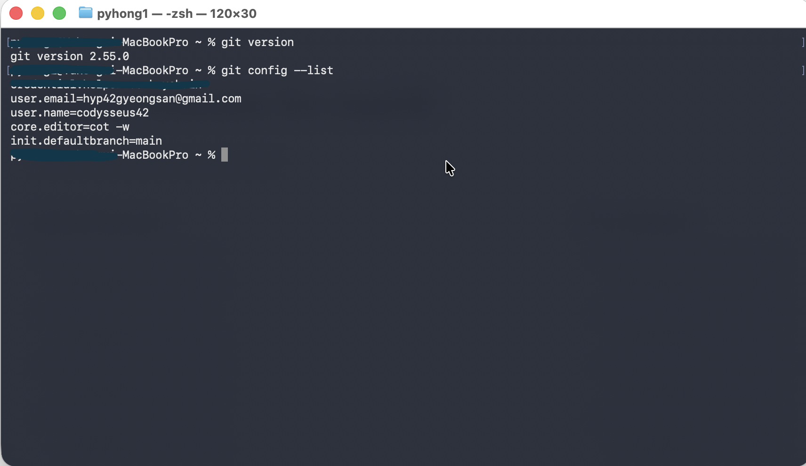

Python 버전 확인 및 `print("Hello")` 실행

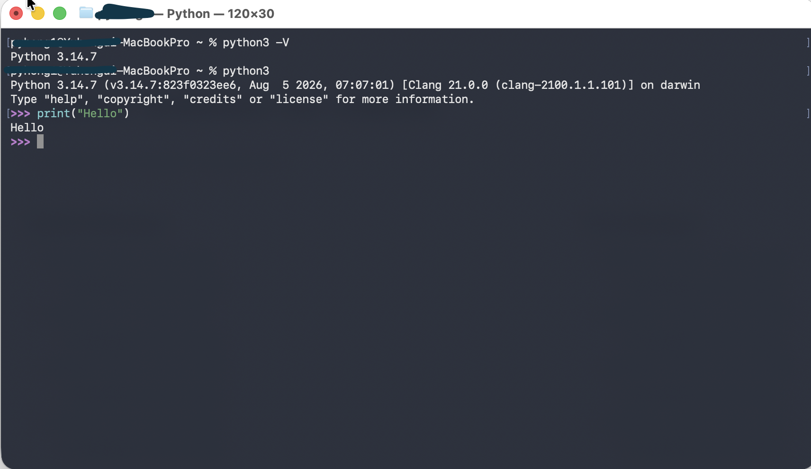

VSCode 확장 설치 (Python, Python Debugger, Korean Language Pack)

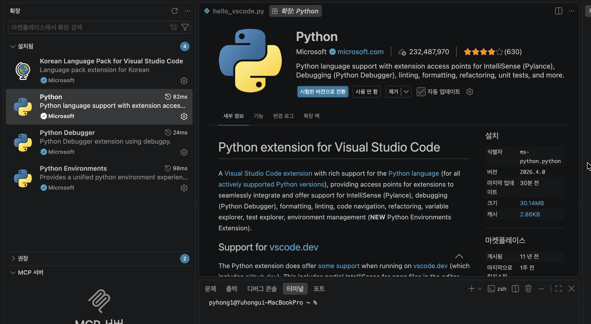

VSCode - GitHub 계정 연동

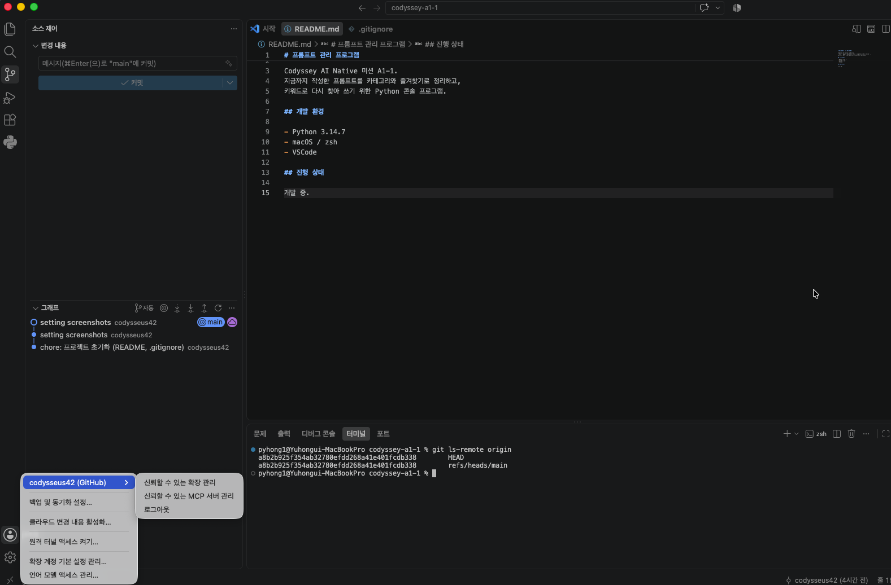

---

---

## 평가 항목 대응

### 1. 동작하는 프롬프트 관리 프로그램

| 평가 항목 | 대응 위치 |
|---|---|
| 터미널에서 메뉴 번호를 입력해 기능을 선택하는 콘솔 기반 프로그램 | [기능 목록](#기능-목록) |
| 프롬프트 추가 | [1. 프롬프트 추가](#1-프롬프트-추가) |
| 목록 보기 | [2. 프롬프트 목록](#2-프롬프트-목록) |
| 카테고리별 조회 | [3. 카테고리별 조회](#3-카테고리별-조회) |
| 검색 | [4. 프롬프트 검색](#4-프롬프트-검색) |
| 상세 보기 | [5. 프롬프트 상세 보기](#5-프롬프트-상세-보기) |
| 즐겨찾기 | [6. 즐겨찾기 관리](#6-즐겨찾기-관리) · [7. 즐겨찾기 목록](#7-즐겨찾기-목록) |
| 실행 중 추가한 프롬프트와 즐겨찾기 상태 유지 (종료 시 초기화) | [데이터 구조](#데이터-구조) |
| 이전 미션 프롬프트 3개 이상 기본 등록 | [기본 등록 데이터](#기본-등록-데이터) |

### 2. GitHub 저장소

| 평가 항목 | 대응 위치 |
|---|---|
| 프로젝트 코드가 GitHub에 업로드 | [main.py](./main.py) · [function.py](./function.py) |
| 최소 10개 이상의 의미 있는 커밋 (기능 단위) | [커밋 히스토리](../../commits/main/) — 총 18개 |
| 최소 1회 이상의 브랜치 생성 및 병합 기록 | [Git 작업 이력](#git-작업-이력) |
| README.md에 프로그램 설명과 실행 방법 | [프로젝트 개요](#나만의-프롬프트-관리-프로그램) · [실행 방법](#실행-방법) |

### 3. 코드 품질

| 평가 항목 | 대응 위치 |
|---|---|
| 함수를 사용하여 기능별로 코드가 분리 | [파일 구성](#파일-구성) — `function.py`에 기능별 함수 9개 분리 |

### 4. 제출물

| 제출물 | 대응 위치 |
|---|---|
| GitHub 저장소 URL | https://github.com/codysseus42/codyssey-a1-1 |
| 개발 환경 설정 스크린샷 (VSCode · Python 버전 · Git 설정) | [환경 설정 확인](#환경-설정-확인) |
| 프로그램 실행 결과 스크린샷 (메뉴 · 추가 · 목록 · 검색 등) | [기능 목록](#기능-목록) 각 절 |
| `git log --oneline --graph` 결과 스크린샷 | [Git 작업 이력](#git-작업-이력) |

### 세부 기능 요구사항

| # | 요구사항 | 대응 위치 |
|---|---|---|
| 3 | 메뉴 출력 · 번호 선택 · 오입력 안내 · 종료 · 기능 후 메뉴 복귀 | [기능 목록](#기능-목록) · [0. 종료](#0-종료) |
| 4 | 리스트와 딕셔너리로 저장, 제목·내용·카테고리·즐겨찾기 포함 | [데이터 구조](#데이터-구조) |
| 5 | 빈 입력 재요청 · 카테고리 선택 · 즐겨찾기 기본값 False | [1. 프롬프트 추가](#1-프롬프트-추가) |
| 6 | **추가 브랜치에서 작업 후 main에 병합** | [Git 작업 이력](#git-작업-이력) — `feature/list` |
| 7 | 카테고리 선택 후 해당 항목만 출력 · 없으면 안내 | [3. 카테고리별 조회](#3-카테고리별-조회) |
| 8 | 제목 또는 내용 포함 검색 · 결과 없으면 안내 | [4. 프롬프트 검색](#4-프롬프트-검색) |
| 9 | 전체 내용 출력 · 잘못된 번호 안내 | [5. 프롬프트 상세 보기](#5-프롬프트-상세-보기) |
| 10 | 즐겨찾기 추가/해제 · 모아보기 | [6. 즐겨찾기 관리](#6-즐겨찾기-관리) · [7. 즐겨찾기 목록](#7-즐겨찾기-목록) |
| 12 | README 4개 항목 (설명 · 실행 방법 · 기능 목록 · 카테고리 설명) | [실행 방법](#실행-방법) · [기능 목록](#기능-목록) · [프롬프트 카테고리](#프롬프트-카테고리) |

---

## 제약 사항 준수

| 제약 항목 | 준수 내용 |
|---|---|
| Python 3.10 이상 | Python 3.14.7 사용 — [개발 환경](#개발-환경) |
| 외부 라이브러리 없이 기본 문법만 사용 | `import` 문 없음. `print` · `input` · `str` 메서드 · `enumerate` · `max` 등 내장 기능만 사용 |
| 모든 코드를 한 곳에 몰아넣지 않고 기능별 함수 분리 | `main.py`(진입점·데이터·메뉴 루프) / `function.py`(기능 함수 9개) — [파일 구성](#파일-구성) |
| 최소 10개 이상의 의미 있는 커밋 | 18개. 기능 단위로 분리하고 `feat` · `fix` · `refactor` · `docs` · `chore` 접두어로 변경 의도 표기 |
| `init` 사용 | 로컬 저장소 초기화 — [Git 작업 이력](#git-작업-이력) |
| `add` · `commit` · `push` 사용 | 첫 커밋 및 원격 푸시 — [Git 작업 이력](#git-작업-이력) |
| `clone` 사용 | 공개 저장소(psf/requests) clone 후 구조·로그 확인 — [Git 작업 이력](#git-작업-이력) |
| `checkout` · `merge` 사용 | `feature/list` 브랜치 생성 후 main에 병합 — [Git 작업 이력](#git-작업-이력) |
| `pull` 사용 | GitHub 웹에서 README 수정 후 로컬 동기화 — [Git 작업 이력](#git-작업-이력) |

---

## 실행 방법

```bash
git clone https://github.com/codysseus42/codyssey-a1-1.git
cd codyssey-a1-1
python3 main.py
```

Python 3.10 이상이면 별도 설치 없이 바로 실행됩니다. 설치할 패키지가 없습니다.

### 파일 구성

```
codyssey-a1-1/
├── main.py        # 진입점, 샘플 데이터, 메뉴 루프
├── function.py    # 기능별 함수 및 상수(MENU, CATEGORY)
└── img/           # 스크린샷
```

---

## 기능 목록

프로그램 실행 시 메뉴가 출력되고, 번호를 입력해 기능을 선택합니다. 각 기능 수행 후에는 메뉴로 돌아옵니다. 잘못된 번호를 입력하면 안내 메시지를 출력하고 다시 메뉴를 보여줍니다.

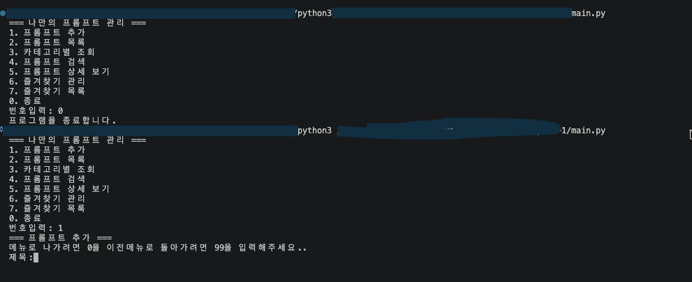

### 1. 프롬프트 추가

제목, 내용, 카테고리를 순서대로 입력받아 새 프롬프트를 등록합니다.

- 입력값이 비어 있으면 다시 입력을 요청합니다
- 이미 등록된 제목은 중복으로 거부합니다
- 카테고리는 미리 정의된 6개 목록에서 번호로 선택합니다
- ID는 기존 최대값 + 1로 자동 발급되며, 삭제된 번호를 재사용하지 않습니다
- 즐겨찾기 기본값은 `False`입니다
- 추가 직후 등록된 내용을 상세 화면으로 확인시켜 줍니다

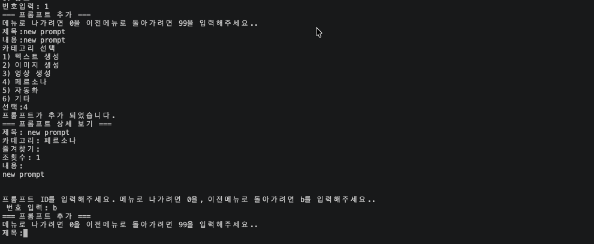

### 2. 프롬프트 목록

등록된 모든 프롬프트를 번호와 함께 출력합니다. 제목, 카테고리, 즐겨찾기 여부(⭐), ID, 조회수를 표시합니다. 목록에서 번호를 선택하면 바로 상세 보기로 이동합니다. 프롬프트가 없으면 안내 메시지를 출력합니다.

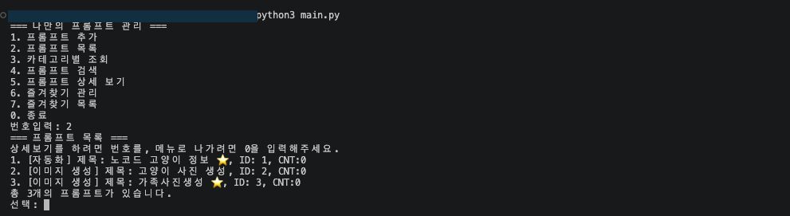

### 3. 카테고리별 조회

카테고리 목록을 보여주고, 선택한 카테고리에 속한 프롬프트만 출력합니다. 해당 카테고리에 프롬프트가 없으면 안내 메시지를 출력합니다.

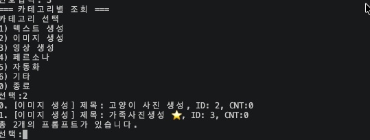

### 4. 프롬프트 검색

키워드를 입력받아 제목 또는 내용에 해당 문자열이 포함된 프롬프트를 찾습니다.

- 대소문자를 구분하지 않습니다
- 내용에서 일치한 경우, 일치 지점 전후 10자를 발췌해 함께 보여줍니다
- 검색 결과가 없으면 안내 메시지를 출력합니다

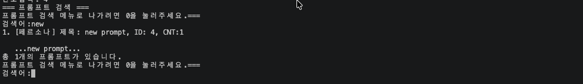

### 5. 프롬프트 상세 보기

ID를 입력하면 해당 프롬프트의 제목, 카테고리, 즐겨찾기 여부, 조회수, 전체 내용을 출력합니다. 존재하지 않는 ID를 입력하면 안내 메시지를 출력합니다.

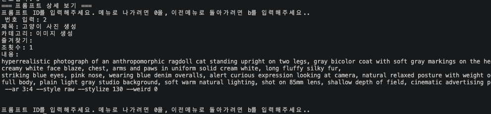

### 6. 즐겨찾기 관리

번호를 선택하면 해당 프롬프트의 즐겨찾기 상태가 전환됩니다. 이미 즐겨찾기된 항목은 해제되고, 아닌 항목은 추가됩니다.

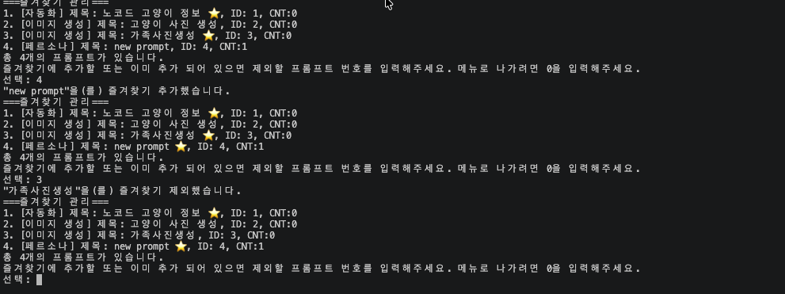

### 7. 즐겨찾기 목록

즐겨찾기로 등록된 프롬프트만 모아서 출력합니다. 등록된 항목이 없으면 안내 메시지를 출력합니다.

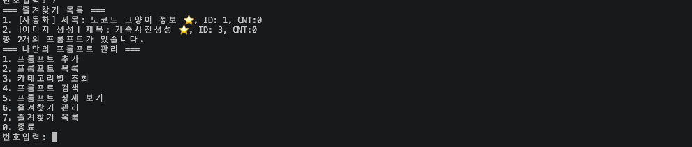

### 0. 종료

프로그램을 종료합니다.

---

## 프롬프트 카테고리

프롬프트는 아래 6개 카테고리 중 하나로 분류됩니다.

| 번호 | 카테고리 | 설명 |
|---|---|---|
| 1 | 텍스트 생성 | 글쓰기, 요약, 번역 등 텍스트를 만들어내는 프롬프트 |
| 2 | 이미지 생성 | Midjourney 등 이미지 생성 모델에 사용하는 프롬프트 |
| 3 | 영상 생성 | Kling 등 영상 생성 모델에 사용하는 프롬프트 |
| 4 | 페르소나 | 모델에 특정 역할이나 인격을 부여하는 프롬프트 |
| 5 | 자동화 | 워크플로우에 삽입해 판단·분류·변환을 맡기는 프롬프트 |
| 6 | 기타 | 위 분류에 속하지 않는 프롬프트 |

### 기본 등록 데이터

프로그램 시작 시 Phase 1에서 실제로 작성했던 프롬프트 3건이 미리 등록되어 있습니다.

| ID | 제목 | 카테고리 | 출처 |
|---|---|---|---|
| 1 | 노코드 고양이 정보 | 자동화 | n8n 워크플로우의 게시글 분류·요약·감성분석 프롬프트 |
| 2 | 고양이 사진 생성 | 이미지 생성 | Midjourney 의인화 래그돌 고양이 광고 컷 |
| 3 | 가족사진생성 | 이미지 생성 | Midjourney 가족 포트레이트 광고 컷 |

---

## 데이터 구조

프롬프트는 딕셔너리를 담은 리스트(`list[dict]`)로 관리합니다.

```python
{
    "id": 1,                    # 고유 식별자, 재사용하지 않음
    "title": "노코드 고양이 정보",
    "content": "...",
    "category": "자동화",
    "favorite": True,           # 즐겨찾기 여부
    "cnt": 0                    # 조회수
}
```

**데이터는 프로그램 실행 중에만 유지되며, 종료하면 초기화됩니다.** 파일 저장 기능은 구현하지 않았습니다.

`cnt`(조회수)는 보너스 과제 "상세 보기 시 사용 횟수 기록"의 일부 구현입니다. 상세 보기로 진입할 때마다 1씩 증가하며 목록과 상세 화면에 표시됩니다. 조회수 기준 정렬(Top 목록)은 구현하지 않았습니다.

---

## 알려진 제약

- 터미널 표준 입력의 한계로, 입력 중 한글을 백스페이스로 지우면 화면이 깨질 수 있습니다. `readline` 모듈을 붙이면 해결되지만 "외부 라이브러리 없이 기본 문법만 사용" 제약에 따라 표준 `input()`만 사용했습니다. 잘못 입력한 경우 그대로 Enter를 누르면 재입력을 요청합니다.
- 제목으로 `0`이나 `99`를 사용할 수 없습니다. 두 값을 메뉴 탈출 신호로 쓰고 있기 때문입니다.

---

## Git 작업 이력

원격 저장소 생성

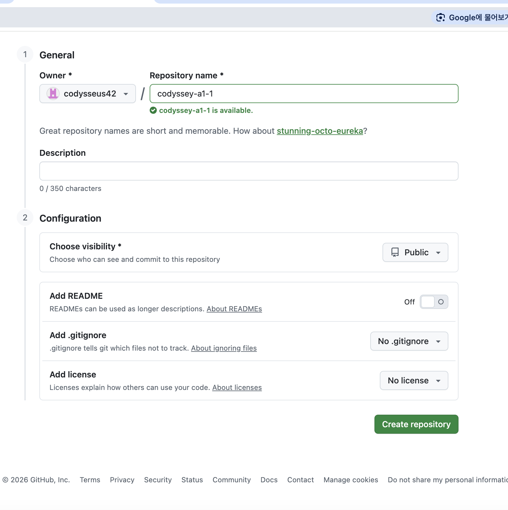

첫 커밋 및 원격 연결, 푸시 (`add`, `commit`, `remote add`, `push`)

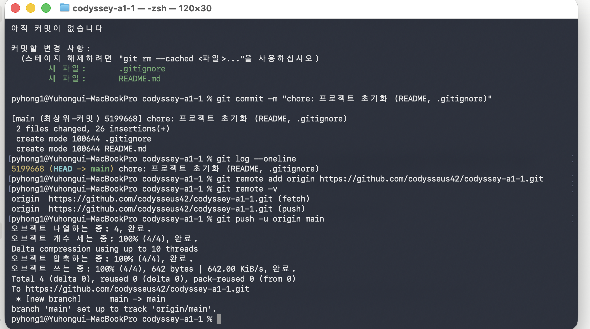

공개 저장소 clone 및 구조·로그 확인 (`clone`, `log --graph`, `branch -a`)

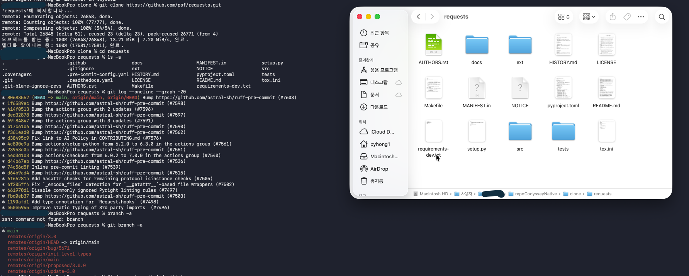

브랜치 생성 및 병합 이력 (`checkout`, `merge`)

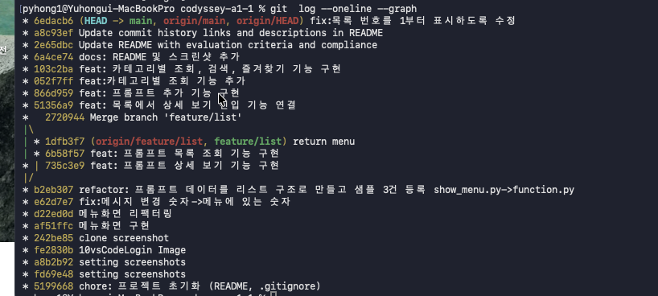

프롬프트 목록 기능은 `feature/list` 브랜치에서, 상세 보기 기능은 `main`에서
각각 작업한 뒤 병합했습니다. 양쪽이 독립적으로 진행되어 3-way merge가 발생했고,
그래프에 분기와 병합 기록이 남았습니다.
